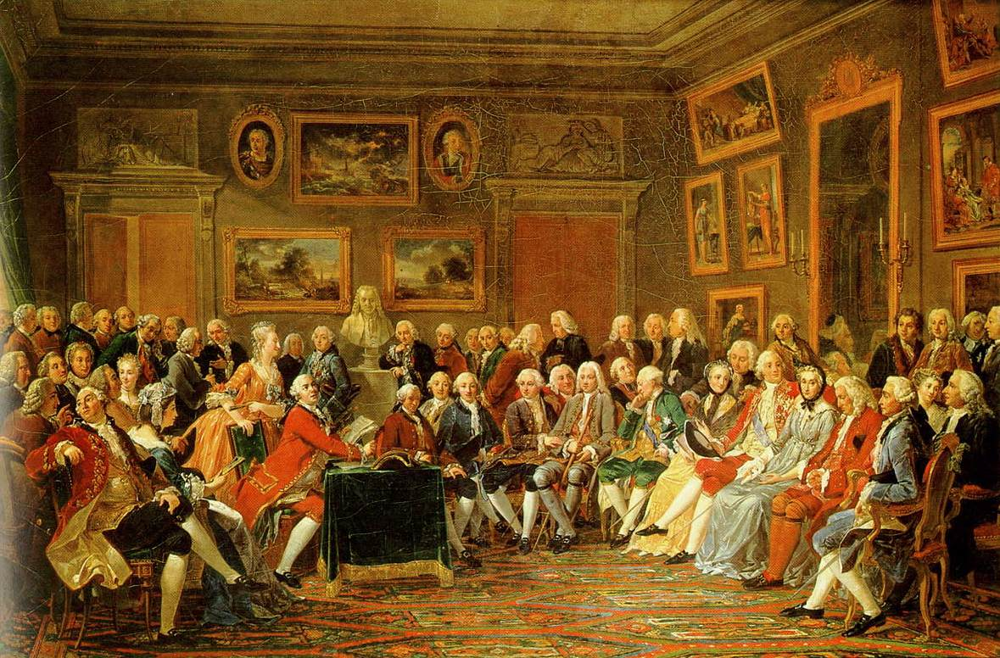

# Paper Reading Club

| Date       | Title | URL  | Host |
|------------|-------|------|------|
|28.07.2024| Scaling to Very Very Large Corpora for Natural Language Disambiguation |[ACL](https://aclanthology.org/P01-1005/)| Jafar Isbarov |
|03.08.2024| Self-Play Fine-Tuning Converts Weak Language Models to Strong Language Models |[arXiv](https://arxiv.org/abs/2401.01335)| Kavsar Huseynova |
|10.08.2024| Direct Preference Optimization: Your Language Model is Secretly a Reward Model |[NeurIPS](https://neurips.cc/virtual/2023/oral/73865)| Mirakram Aghalarov |
|17.08.2024| Is Cosine-Similarity of Embeddings Really About Similarity? |[arXiv](https://arxiv.org/abs/2403.05440)| Eyvaz Najafli |
|24.08.2024| Vision Transformers Need Registers |[ICLR](https://iclr.cc/virtual/2024/oral/19794)| Sanur Jujuyeva |
|31.08.2024| Grad-CAM: Visual Explanations from Deep Networks via Gradient-Based Localization | [ICCV](https://openaccess.thecvf.com/content_ICCV_2017/papers/Selvaraju_Grad-CAM_Visual_Explanations_ICCV_2017_paper.pdf)| Lala Ibadullayeva |
